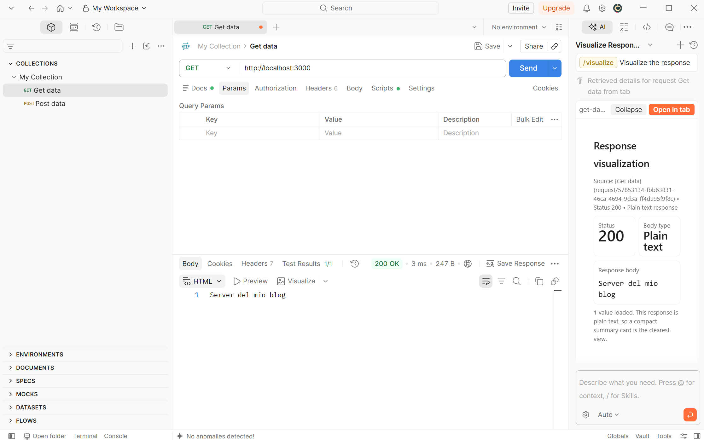
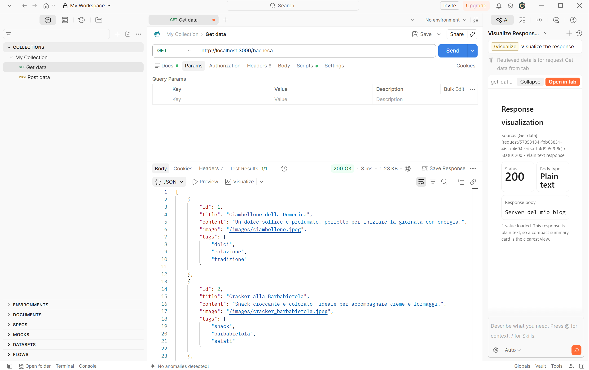
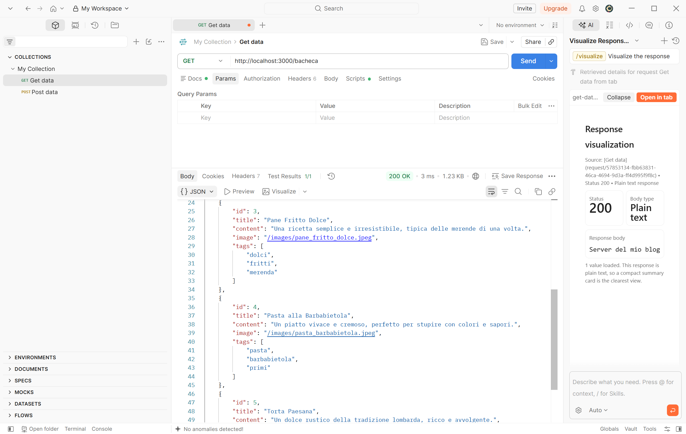
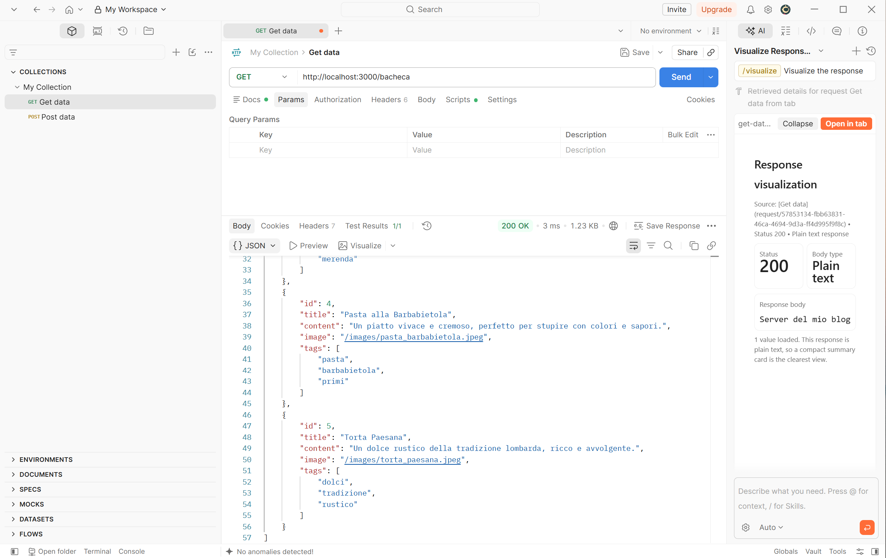
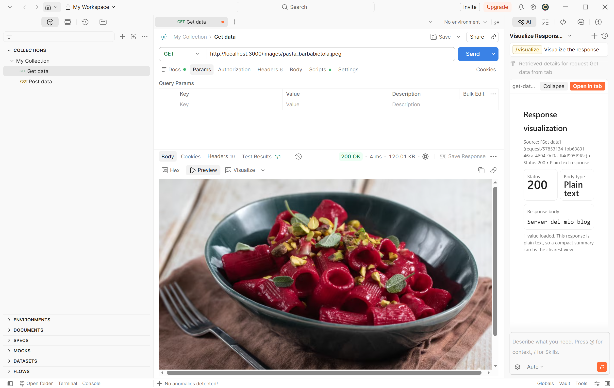

 
# Express Blog Intro

Il progetto consiste nella realizzazione di un’applicazione backend **Node.js/Express** che funge da base per un blog personale. L’obiettivo è costruire un’architettura incrementale, estendibile e modulare, che possa essere arricchita progressivamente con nuove funzionalità man mano che si acquisiscono competenze aggiuntive.

# Obiettivi

- Creare il progetto base con una rotta base `/` che ritorni un testo semplice con scritto ”Server del mio blog”.
- Creare un array dove inserire una lista di almeno 5 post, per ognuno indicare titolo, contenuto, immagine e tags che sarà un array di stringhe.
- Creare una rotta `/bacheca` che restituisca un oggetto json con la lista dei post.
- Configurare gli asset statici sull’applicazione in modo che si possano visualizzare le immagini associate ad ogni post.
- Testare su Postman.

# Screenshot Test Postman

## Test rotta base

## Test rotta bacheca

## Test asset statici

